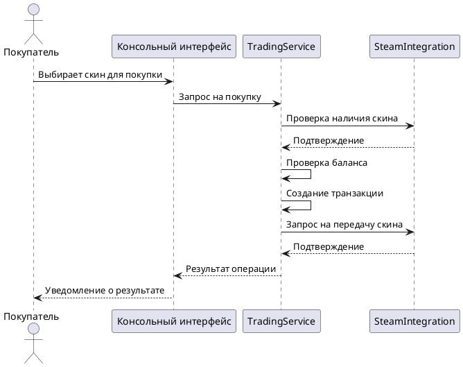
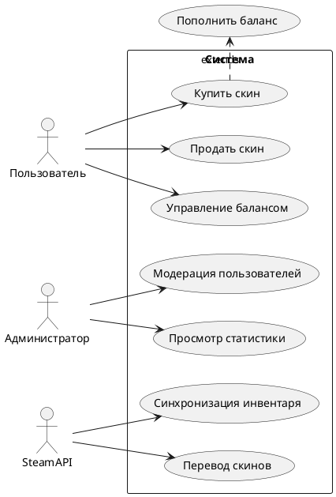
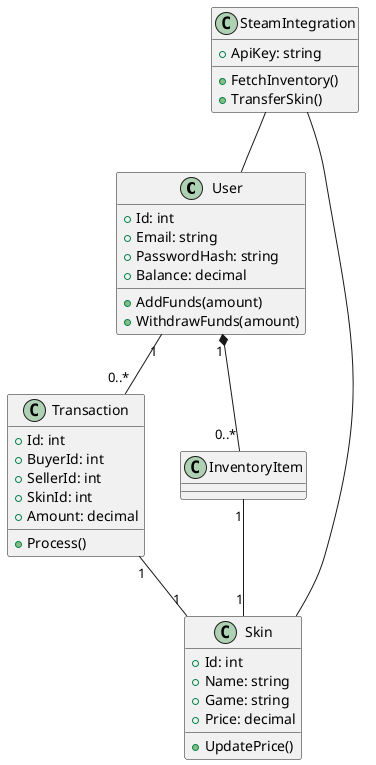

# 📚 SkinTradingApp: Система торговли игровыми скинами

🚀 Консольное приложение на C# для безопасной торговли игровыми предметами (скинами) между пользователями. Система предоставляет удобный интерфейс для покупки, продажи и управления инвентарем скинов.

GitHub License .NET 8.0 SQLite/In-memory DB

## ✨ Ключевые возможности

- 👤 **Управление пользователями**: Регистрация, авторизация, баланс
- 🎮 **Торговля скинами**: Покупка и продажа предметов между пользователями
- 🏦 **Инвентарь**: Просмотр своих скинов
- 💰 **Комиссионная система**: Автоматический расчет комиссии при сделках
- 🔄 **Интеграция с Steam**: (Имитация) передача скинов между аккаунтами
- ⚖️ **Транзакции**: История всех операций

## 🎮 Команды меню

### Гостевые команды:
| Действие | Что делает? |
|----------|-------------|
| Войти в систему | Авторизация существующего пользователя |
| Зарегистрироваться | Создание нового аккаунта |
| Просмотреть доступные скины | Показать все скины на площадке |
| Выйти из программы | Завершение работы |

### Авторизованные команды:
| Действие | Что делает? |
|----------|-------------|
| Просмотреть мой инвентарь | Показать все скины пользователя |
| Купить скин | Покупка выбранного скина у другого пользователя |
| Продать скин | Продажа скина из своего инвентаря |
| Выйти из аккаунта | Завершение текущей сессии |
| Выйти из программы | Завершение работы |

## 🗃️ База данных

### 📑 Таблицы
| Таблица | Назначение | Поля |
|---------|------------|------|
| Users | Хранит пользователей | Id (PK), Email, PasswordHash, Balance |
| Skins | Хранит скины | Id (PK), Name, Game, Rarity, Price, Condition, SteamItemId |
| InventoryItems | Связь пользователей и скинов | Id (PK), UserId (FK), SkinId (FK) |
| Transactions | История сделок | Id (PK), BuyerId (FK), SellerId (FK), SkinId (FK), Amount, Date |

### 🔗 Связи
- Один-ко-многим:
  - Users → InventoryItems: Один пользователь — много скинов в инвентаре
  - Users → Transactions (как Buyer): Один покупатель — много покупок
  - Users → Transactions (как Seller): Один продавец — много продаж
  - Skins → InventoryItems: Один скин может быть у многих пользователей (в разное время)

## 🛠️ Инициализация

База данных создается автоматически при первом запуске (in-memory). Для работы с реальной СУБД:

1. Установите .NET 8.0 SDK
2. Установите SQLite (или другую СУБД)
3. Настройте строку подключения в `appsettings.json`

## 📈 Диаграммы

### 1. 🔄 Диаграмма последовательностей (Покупка скина)




### 2. 🎯 Диаграмма вариантов использования




### 3. 🧱 Диаграмма классов




## 🛠️ Установка и запуск

### Требования:
- .NET 8.0 SDK
- Для работы с реальной БД: SQLite/SQL Server

### Запуск:
```bash
dotnet restore
dotnet build
dotnet run
```

## 🧩 Основные классы

### 📖 Модели
- **User**: Пользователь системы (email, пароль, баланс)
- **Skin**: Игровой предмет (название, игра, редкость, цена)
- **InventoryItem**: Связь пользователя и скина
- **Transaction**: Запись о сделке (покупатель, продавец, скин, сумма)

### 💾 Данные
- **DatabaseContext**: Контекст Entity Framework Core
- **Repositories**: Классы для работы с данными (UserRepository, SkinRepository)

### ⚙️ Сервисы
- **AuthService**: Управление пользователями и аутентификацией
- **TradingService**: Основная бизнес-логика торговли
- **InventoryService**: Управление инвентарем

### 🎬 Программа
- **ConsoleService**: Главный консольный интерфейс
- **MenuBuilder**: Построитель меню

## 📝 Заметки

1. Для реального использования необходимо:
   - Реализовать хеширование паролей
   - Добавить интеграцию с реальным Steam API
   - Настроить работу с постоянной БД (не in-memory)

2. Система комиссий:
   - При продаже скина взимается 10% комиссия
   - Комиссия рассчитывается автоматически

3. Безопасность:
   - Все транзакции выполняются в рамках одной атомарной операции
   - Проверка баланса перед сделкой
   - Валидация входных данных


Итог выполнения Программы: 


